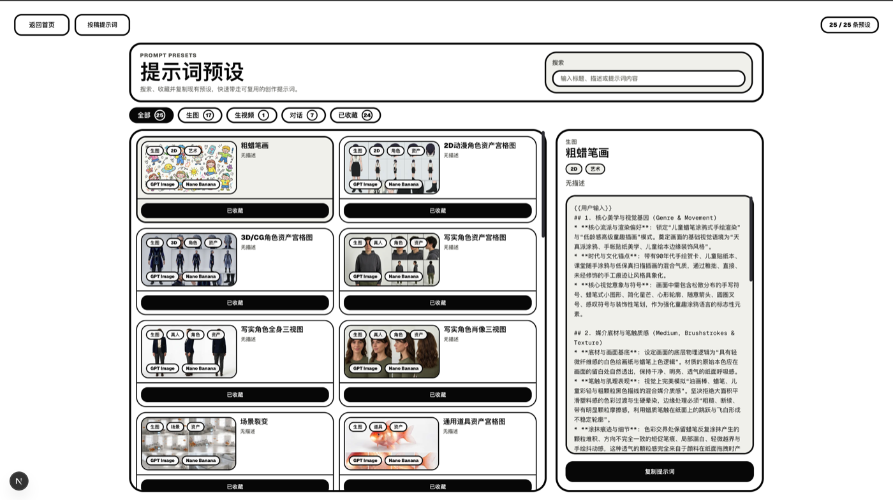
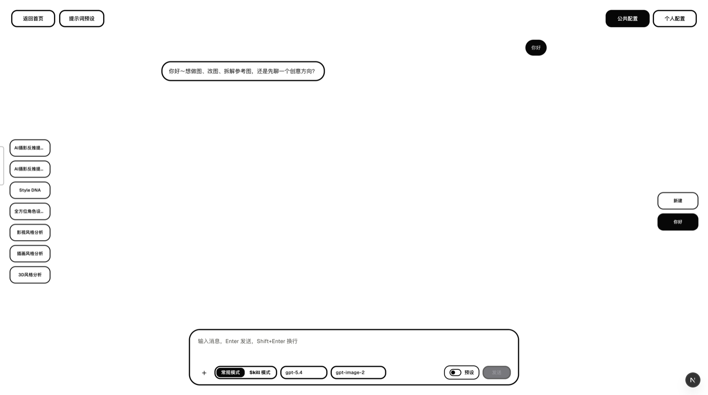

<p align="center">
  <a href="https://otato.art">
    
  </a>
</p>

# oTATo Art

<p align="center">
  开源 AI 内容创作工作台：把对话、图片、视频、剧本、画布、画廊和提示词预设放在同一个创作流程里。
</p>

<p align="center">
  <a href="https://otato.art"><strong>访问网站</strong></a>
  ·
  <a href="https://github.com/susu177990-rgb/otato.art"><strong>GitHub 仓库</strong></a>
  ·
  <a href="./DESIGN.md"><strong>设计规范</strong></a>
</p>

## 这个项目是做什么的

oTATo Art 是给内容创作者用的 AI 工作台。它不是单独的聊天工具、生图工具或素材库，而是把从想法、提示词、剧本、视觉资产到生成记录的流程串在一起。

如果你在做短剧、角色设定、分镜、视觉参考、AI 图片/视频生成，或者想沉淀自己的提示词方法，这个项目就是一个可以自己部署、自己配置、自己继续改的创作系统。

## Features / 核心特点

- **自定义 API**：模型和网关配置可以放在自己的环境里，适合个人或团队内部使用。
- **多工作区创作**：对话、图片、视频、剧本、画布、预设和画廊是同一个产品里的连续入口。
- **提示词预设**：支持提示词预设、搜索、收藏和复用，方便沉淀自己的创作方法。
- **生成结果可回看**：图片、视频、项目记录和画布素材可以继续整理，不是一次性提交后就丢掉。
- **面向长期创作**：适合围绕一个项目持续积累资料、角色、分镜、视觉方向和生成历史。

## 主要功能

| 模块 | 用来做什么 |
| --- | --- |
| 对话 | 用 Agent、Skill 和多会话推进创意、拆解需求、整理方案 |
| 图片 | 通过模式化生图、参考图和历史记录生产视觉素材 |
| 视频 | 生成和管理视频素材，保留动态创作记录 |
| 剧本 | 管理项目、立项信息、人物设定和分集创作 |
| 画布 | 把素材、分镜、灵感和关系放到可视空间里整理 |
| 预设 | 搜索、收藏、复制和维护提示词预设 |
| 画廊 | 集中查看和复用生成结果 |

## 界面预览

<table>
  <tr>
    <td width="50%">
      <strong>生图工作台</strong><br>
      
    </td>
    <td width="50%">
      <strong>无限画布</strong><br>
      
    </td>
  </tr>
  <tr>
    <td width="50%">
      <strong>提示词预设</strong><br>
      
    </td>
    <td width="50%">
      <strong>对话工作台</strong><br>
      
    </td>
  </tr>
</table>

## Installation

```bash
npm install
```

在仓库根目录创建 `.env.local`：

```env
NEXT_PUBLIC_SUPABASE_URL=https://your-project.supabase.co
NEXT_PUBLIC_SUPABASE_ANON_KEY=your-anon-key
SUPABASE_SERVICE_ROLE_KEY=your-service-role-key
APP_ORIGIN=http://localhost:4000
```

## Usage

启动本地开发环境：

```bash
npm run dev
```

打开：

```text
http://localhost:4000
```

常见使用路径：

1. 进入首页，选择对话、图片、视频、剧本、画布或预设。
2. 配置自己的 API、模型和站内设置。
3. 用项目、历史记录、画廊和画布把生成结果继续沉淀下来。

## Development

```bash
npm run lint
npx tsc --noEmit
npm test
```

端到端 smoke：

```bash
npm run dev
E2E_BASE_URL=http://localhost:4000 E2E_EMAIL=you@example.com E2E_PASSWORD=your-password npm run e2e:smoke
```

这条回归会检查未登录跳转、公共提示词预设加载、提示词页搜索入口、登录态项目创建/读取/清理，以及预设收藏/取消收藏。没有测试账号时可临时设置 `E2E_ALLOW_AUTH_SKIP=1` 只跑公共链路。

更多项目约定：

- [DESIGN.md](./DESIGN.md)：界面和产品设计规范
- [AGENTS.md](./AGENTS.md)：仓库内 Agent 工作约定

## 发布边界

- **代码许可**：项目源码使用 [MIT License](./LICENSE)，允许复制、修改、分发、二次开发和商用。
- **品牌素材**：仓库里的 oTATo Art 名称、Logo、截图和展示文案可随源码保留用于说明项目来源；如果你发布自己的产品版本，建议替换成自己的品牌资产，避免用户混淆。
- **模型与 API 费用**：本项目不包含第三方模型额度。OpenAI、Claude、Gemini、DeepSeek、Seedance、Veo、Nano Banana 等模型的 API Key、调用费用、内容安全和服务条款由部署者自行负责。
- **密钥与数据**：不要提交真实 `.env.local`、Supabase service role key、个人 API Key 或用户数据。生产环境应通过部署平台环境变量管理密钥。
- **自部署责任**：数据库迁移、Supabase 权限、存储桶策略、邮件回调域名和模型网关配置需要由部署者在自己的环境中确认。

## Contributing

欢迎继续完善创作流程、界面一致性、提示词预设、画布体验和生成记录管理。提交前建议至少运行 lint 和类型检查。

## License

MIT License. See [LICENSE](./LICENSE).
