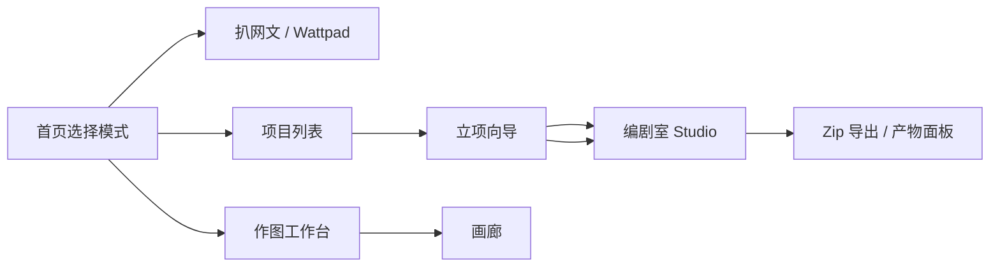

# Gleam Media Studios

**由 [Gleam Media Studios, Inc.](https://github.com/gleam-studios) 出品**

面向 **系列化影视与流媒体内容** 的一体化创作工作台：从网文素材检索、项目立项与改编策划，到七阶段编剧室写作，再到角色/分镜/道具向 AI 生图与画廊归档——整条链路收敛在同一套深色玻璃质感 Web 应用中。团队可在浏览器里完成「找参考 → 立项目 → 写剧本 → 出视觉资产」的闭环，而无需在多个零散工具之间来回切换。

| | |
|---|---|
| **产品形态** | SaaS 化 Web 应用（Next.js 全栈） |
| **目标用户** | 编剧、策划、制片与视觉前期 |
| **核心语言** | 中文工作流为主，支持英语 Locale 简报等出海向产物 |
| **当前版本** | `1.1.0`（见 `package.json`） |

---

## 我们解决什么问题？

系列化内容制作往往把 **素材调研、立项文档、分集写作、角色定妆** 拆在不同表格、聊天窗口和生图工具里，上下文容易断裂，版本也难以对齐。**Gleam Media Studios** 把这些环节 **产品化** 为可重复的工作流：

1. **扒网文** — 在 Wattpad 等来源检索、预览、导出素材，为改编立项提供输入。
2. **创剧本** — 用结构化立项向导产出思路书、系列圣经、英语简报，再进入编剧室按阶段推进。
3. **作图** — 按模式（角色资产、分镜、道具等）调用多路生图模型，参考图 + 提示词模版一键生成，并在画廊沉淀。

所有大模型与生图能力均通过你在 **设置** 中配置的 **OpenAI 兼容 API** 接入，便于对接自建网关或第三方中转；业务数据与账号体系由 **Supabase**（PostgreSQL + Auth）承载，支持团队多账号与行级隔离。

---

## 典型工作流



| 阶段 | 你在做什么 | 系统产出 |
|------|------------|----------|
| 素材 | 搜索 Wattpad、导出章节或梗概 | Markdown / 结构化素材，供改编分析 |
| 立项 | 填写基本信息、上传 PDF/DOCX、与策划 Agent 对话 | 创作思路确认书、系列圣经、英语 Locale 简报 |
| 编剧 | 在 Studio 按 7 个 Stage 推进，Gate 校验 | 大纲、分集梗概、剧本正文等 Markdown 产物 |
| 视觉 | 选择生图模式、比例、参考图 | 角色板、分镜、道具宫格等；历史与画廊可追溯 |

设计规范与信息架构的单一事实来源见 **[DESIGN.md](./DESIGN.md)**；面向贡献者的 Next.js 与 Supabase 约定见 **[AGENTS.md](./AGENTS.md)**。

---

## 功能详解

### 扒网文（`/wattpad`）

- 关键词搜索 Wattpad 条目，表格浏览 + 右侧预览。
- 支持导出 Markdown、批量任务与梗概翻译等（依赖可选 **`wattpad-api`** 子服务）。
- 适合改编前期的 **选题与文本采样**，结果可进入立项素材环节。

### 创作剧本

**项目列表（`/projects`）**  
创建、搜索、排序项目；卡片展示验证进度、集数、圣经是否就绪等状态。

**立项向导（`/project/[id]/onboarding`）**  
四 Tab 单页：**基本信息 → 素材 → 策划 → 立项确认**。支持 **原创 / 改编** 模式；可解析 PDF/DOCX，与策划对话 Agent 协作，最终确认三份核心文档后 **一键进入编剧室**。

**编剧室（`/studio/[id]`）**  
- 顶栏 **7 阶段条**（Stage Strip）+ Gate 计数 + 产物预览 Popover。  
- 左侧 **对话窗**（Chat），右侧 **结构化产物面板**（Artifact）。  
- 思路书 / 系列圣经 / 英语简报抽屉；自动推进流水线、分集体检、Zip 导出等。  
- 内置 **`agent/script-agent`** 知识库、技能与模版，由 Route Handler 加载并注入 LLM 上下文。

### 作图（`/image`、`/image/gallery`）

- **多模型**：如 `gpt-image-2`、`nano-banana-2`、`nano-banana-pro` 等，在 Composer 底栏切换。  
- **模式化生图**：自由模式、真实/2D/3D 角色资产、肖像四视图、道具宫格、分镜生成与分镜延续等；提示词模版可在 **设置 → 生图 提示词** 中维护，支持 `{{占位符}}` 驱动多槽 Composer。  
- **参考图槽**、宽高比（含 16:9 / 9:16 等）、清晰度档位、GPT Image 质量。  
- **画布预览**按图片真实比例完整缩放（不裁切内容）；**画廊**瀑布流浏览历史成片。

### 设置（`/settings`）

全站 **唯一常规配置入口**（首页顶栏「设置」）：

- **LLM API**：各用途的 Endpoint、Key、模型 ID。  
- **生图 API**：按模型槽位配置网关与模型名。  
- **生图提示词**：各模式固定模版与参考图槽提示。  

配置写入 Supabase `site_settings`；**所有登录用户共享** 同一套 API 配置，仅 **管理员邮箱** 可在应用内修改（详见 `AGENTS.md`）。

### 账号与数据

- **登录 / 注册**：`/login`，Supabase Auth 邮箱 + 密码。  
- **数据隔离**：`projects`、`image_gallery_records` 等按 `auth.users` 隔离，RLS 启用。  
- **本地迁移**：旧版 `localStorage` / 本地 JSON 可通过 `scripts/migrate-local-data-to-supabase.ts` 或首次登录时的 `WorkspaceLocalMigration` 导入。

---

## 技术栈

| 层级 | 选型 |
|------|------|
| 运行时 | Node.js **≥ 20** |
| 框架 | **Next.js 16.2**（App Router，`output: "standalone"`） |
| UI | **React 19**、CSS Modules（`app/shared/shell.module.css` 设计体系） |
| 数据 | **Supabase**（PostgreSQL + Auth + RLS） |
| AI | OpenAI 兼容 HTTP API（聊天、策划、生图多路由） |
| 文档解析 | `pdf-parse`、`mammoth`（立项素材） |
| 可选服务 | `services/wattpad-api`（FastAPI） |

---

## 仓库结构

```
├── app/                      # 页面与 Route Handlers
│   ├── api/                  # chat、planning、onboarding、image、projects、wattpad…
│   ├── auth/callback/        # Supabase OAuth / 邮件回调
│   ├── shared/               # 全局 shell / topbar / 表单 primitives
│   └── …                     # 各业务路由
├── components/               # ChatWindow、ArtifactPanel、StudioStageStrip 等
├── lib/                      # 类型、DB 封装、image-workspace、模型预设
├── agent/script-agent/       # 剧本 Agent 提示词、技能、知识库、模版（构建时拷贝进 standalone）
├── services/wattpad-api/     # 可选 Wattpad 代理（Python FastAPI）
├── supabase/migrations/      # 数据库 schema 迁移
├── scripts/                  # 构建辅助、Supabase 数据迁移、子进程启动
├── DESIGN.md                 # 产品与 UI 设计说明
├── AGENTS.md                 # 环境变量、Supabase、开发约定
└── README.md                 # 本文件
```

---

## 快速开始

### 1. 安装依赖

```bash
npm install
```

### 2. 配置 Supabase（必填）

在仓库根目录创建 **`.env.local`**：

```env
NEXT_PUBLIC_SUPABASE_URL=https://你的项目.supabase.co
NEXT_PUBLIC_SUPABASE_ANON_KEY=你的_anon_key
SUPABASE_SERVICE_ROLE_KEY=你的_service_role_key   # 仅服务端与迁移脚本，勿泄露
```

在 Supabase Dashboard：

1. **Authentication → Providers → Email** 开启。  
2. **URL Configuration**：Site URL 设为部署域名；Redirect URLs 包含  
   `https://<域名>/auth/callback` 与 `http://localhost:4000/auth/callback`。

推送数据库 schema：

```bash
supabase login
supabase link --project-ref <你的 project-ref>
supabase db push
```

### 3. 启动开发环境

```bash
# Next（4000）+ 可选 Wattpad API 子进程
npm run dev

# 仅前端
npm run dev:web
```

浏览器打开 **http://localhost:4000**，注册账号后在 **设置** 中填写 LLM / 生图 API。

### 4. 生产构建

```bash
npm run build
npm run start
```

`postbuild` 会将 `agent/` 等资源复制到 **`.next/standalone`**。生产环境监听 **`PORT`**（默认 3000），已绑定 **`0.0.0.0`**。

---

## 环境变量

| 变量 | 说明 |
|------|------|
| `NEXT_PUBLIC_SUPABASE_URL` | Supabase 项目 URL |
| `NEXT_PUBLIC_SUPABASE_ANON_KEY` | 浏览器端 anon / publishable key |
| `SUPABASE_SERVICE_ROLE_KEY` | 服务端与迁移脚本（**勿提交 Git**） |
| `WATTPAD_API_URL` | Wattpad 子服务地址（可选，默认 `http://127.0.0.1:8765`） |
| `PORT` | 容器 / PaaS 注入的 HTTP 端口 |

LLM 与生图的具体 Endpoint、Key、模型名、提示词模版均在应用内 **设置** 维护，无需为每个模型单独写环境变量（默认值可参考 `lib/baked-api-defaults.ts`）。

---

## 从本地旧数据迁移

注册并登录后：

```bash
npx tsx scripts/migrate-local-data-to-supabase.ts --owner-email=你的邮箱@example.com
```

或使用 npm 脚本：

```bash
npm run migrate:supabase -- --owner-email=你的邮箱@example.com
```

---

## 主要 API 路由

| 分类 | 路径（`app/api/` 下） |
|------|------------------------|
| 会话与创作 | `chat`、`planning-chat`、`adaptation-discuss` |
| 项目 | `projects`、`projects/[id]` |
| 立项 / 改编 | `onboarding/*`、`locale-research`、`parse-pdf`、`parse-docx` |
| 编剧辅助 | `episode-stats` |
| 生图 | `image/generate`、`image/gallery` |
| 工作区配置 | `workspace-settings` |
| Wattpad | `wattpad/search`、`export-*`、`translate-synopsis` |
| 认证 | `auth/logout` |

请求体与字段以各 `route.ts` 实现为准。

---

## Wattpad 子服务（可选）

```bash
cd services/wattpad-api
# 创建 venv、安装依赖后
uvicorn main:app --host 0.0.0.0 --port 8765
```

将 **`WATTPAD_API_URL`** 指向该地址；或使用根目录 **`npm run dev`** 由 `concurrently` 尝试一并拉起。

---

## 部署提要（Zeabur / Docker / PaaS）

1. **`npm ci`** → **`npm run build`**。  
2. 在平台注入 Supabase 三个变量与 **`PORT`**。  
3. 确保 Supabase Redirect URL 与线上域名一致。  
4. 进程工作目录为仓库根；使用 **standalone** 产物时按 Next 官方方式启动 `node .next/standalone/server.js`（或项目配置的 `npm run start`）。

更细的 Zeabur / Next 部署可参考 [Zeabur Next.js 指南](https://zeabur.com/docs/en-US/guides/nodejs/nextjs)。

---

## 开发约定

- 本仓库使用的 Next.js 与常见训练数据中的版本存在差异，写服务端代码前请浏览 **`node_modules/next/dist/docs/`** 并留意废弃 API（见 **AGENTS.md**）。  
- UI 变更请对照 **DESIGN.md**，优先复用 **`shell.module.css`** 中的 primitives。  
- 不要提交 **`.env.local`**、`SUPABASE_SERVICE_ROLE_KEY` 或任何真实 API Key。

---

## 关于 Gleam Media Studios, Inc.

**Gleam Media Studios, Inc.** 专注于流媒体与系列化影视向的内容工业化工具。本平台将团队在立项、编剧、视觉前期中沉淀的 **阶段 Gate、提示词模版与视觉资产规范** 固化进可部署的产品，供内部团队与合作伙伴在统一界面中协作。

- **上游仓库**：[github.com/gleam-studios/script--agent](https://github.com/gleam-studios/script--agent)  
- **问题与贡献**：请通过 GitHub Issues / Pull Request 与维护者沟通。  
- **许可证**：二次开发或企业部署请自行补充许可证策略；第三方依赖以各自 `package.json` 许可证为准。

---

## English summary

**Gleam Media Studios** is a production web workspace by **Gleam Media Studios, Inc.** for serialized film and streaming content: optional Wattpad discovery, Supabase-backed projects, a four-tab onboarding flow, a seven-stage writer’s room with chat and structured artifacts, and a mode-driven AI image studio with gallery. Built with **Next.js 16** and **React 19**, shipped as a **standalone** Node bundle for Docker / PaaS hosting. Configure LLM and image APIs through in-app settings using any OpenAI-compatible gateway.
